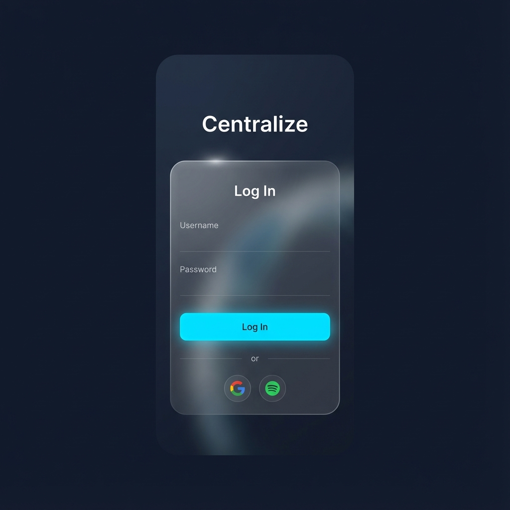
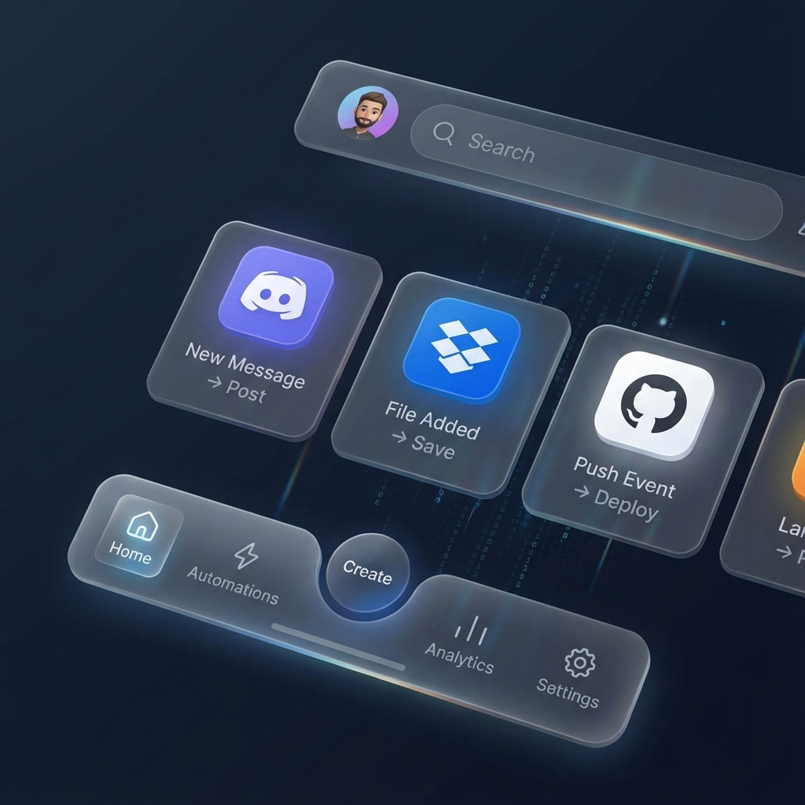
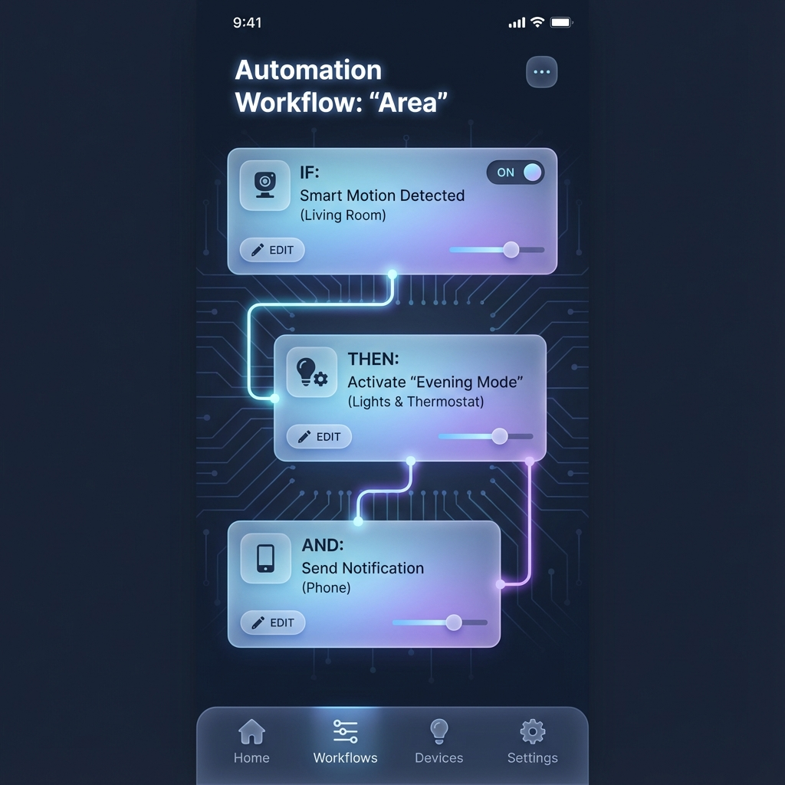

# Automatisation-Mobile-SAAS (Centralize)

<div style="display: flex; gap: 20px; flex-wrap: wrap; justify-content: center;">
  
  
  
</div>

Bienvenue sur la nouvelle version de **Centralize**, une application mobile repensée avec une esthétique **2025 Premium**.

## ✨ Nouveautés Design & UX

Cette mise à jour transforme complètement l'expérience utilisateur :

- **🎨 Dark Mode & Glassmorphism** : Une interface sombre élégante (Slate 900) avec des éléments en verre dépoli (Glassmorphism) pour une profondeur visuelle moderne.
- **🚀 Animations Fluides** : Intégration de `animate_do` pour des entrées dynamiques et des transitions douces.
- **💎 Composants Premium** :
    - **Floating Dock** : Une barre de navigation flottante et floutée, remplaçant la barre traditionnelle.
    - **Cartes Interactives** : Des cartes en verre réactives au toucher.
    - **Background Animé** : Un fond dégradé subtil et vivant.
- **📱 Optimisation Web** : Conçu pour fonctionner parfaitement sur navigateur (Chrome) sans émulateur lourd.

## 🛠 Stack Technique Mise à Jour

- **Framework** : Flutter 3.x
- **Design System** : Custom `AppTheme` (Slate/Sky/Indigo palette).
- **Nouvelles Dépendances** :
    - `glassmorphism`: Pour les effets de flou et de transparence.
    - `animate_do`: Pour les animations d'entrée.
    - `google_fonts`: Pour la typographie moderne (Outfit).
    - `flutter_animate`: Pour les micro-interactions.

## 🚀 Comment Lancer (Web)

Plus besoin d'émulateur Android ! Lancez simplement l'application dans votre navigateur Chrome pour une expérience fluide.

1. **Aller dans le dossier du projet** :
   ```bash
   cd services/web/mobile/gamestore
   ```

2. **Installer les dépendances** :
   ```bash
   flutter pub get
   ```

3. **Lancer en mode Web** :
   ```bash
   flutter run -d chrome
   ```

## 📸 Aperçu des Fonctionnalités

### Authentification
- **Login / Register** : Pages entièrement redesignées avec fond animé et formulaires en verre.
- **Social Auth** : Intégration visuelle des boutons Google/Spotify.

### Dashboard (Home)
- **Liste des Services** : Navigation horizontale fluide.
- **Gestion des Areas** : Cartes visuelles pour activer/désactiver vos automatisations.
- **Création d'Area** : Formulaire intuitif et moderne.

---
